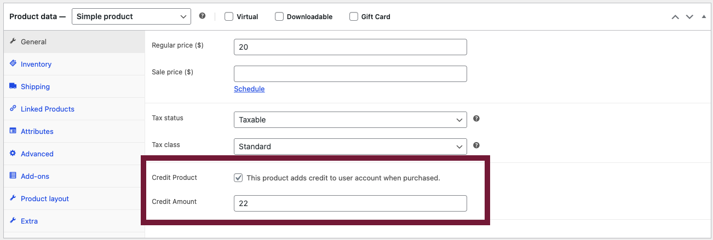
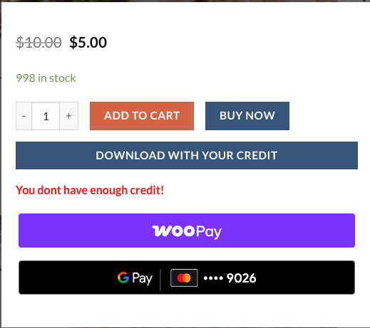
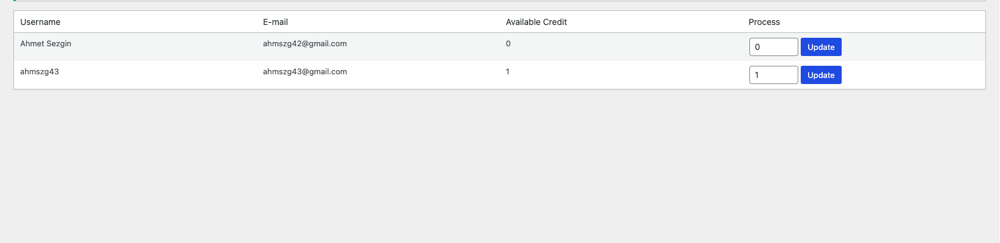

# WooCommerce Credit System

A credit-based digital product download system for WooCommerce. Users can purchase and use credits to download digital files.

## 📜 License
Compatible with WooCommerce.

---

## 📌 Features

### 🔹 Loan Management Panel
- **Admin Panel**: Manage users' credit balances.


### 🔹 Credit Products
- **Create Credit Products**: Add credit-based products (e.g., 100 Credit Pack).



### 🔹 File Download Control
- **Restricted Access**: Users without sufficient credits cannot download files.



### 🔹 My Account Integration
- **User Dashboard**: Users can view their credit balance in the "My Account" section.


---

## 🛠️ Installation

### 1. Upload to WordPress
1. Download the latest version.
2. Go to **WordPress Admin > Plugins > Add New > Upload Plugin**.
3. Select the `custom-download-credits.zip` file and activate the plugin.

### 2. Manual Installation
```bash
cd wp-content/plugins
git clone https://github.com/your-username/woocommerce-credit-system.git
```

---

## 🚀 Usage

### A. Admin Panel

#### 🔹 Creating Credit Products
- When adding a new product, check **“Credit Product”**.
- Enter the credit amount (e.g., 100).

#### 🔹 Managing User Credits
- Edit user credit balances from the **Credit Management** menu.



### B. User Side

#### 🔹 Purchasing Credits
- Add credit pack products to the cart and complete the purchase.

#### 🔹 Downloading Files
- Users can download files using credits by clicking the **"Download"** button on the product page.

---

## 💻 For Developers

### 📂 Project Structure
```
📦 woocommerce-credit-system
 ┣ 📂 admin      # Admin panel classes
 ┣ 📂 public     # Frontend logic
 ┣ 📂 includes   # Core functionality
 ┣ 📂 assets     # CSS/JS/Images
 ┣ 📜 README.md
 ┗ 📜 LICENSE
```

### 🔧 Dependencies
- PHP **7.4+**
- WordPress **5.6+**
- WooCommerce **5.0+**

### 🔌 Hooks & Filters
```php
// Custom credit calculation filter
add_filter('cdc_credit_calculation', function($credit, $product_id) {
    return $credit * 2; // Double the credit value
});
```

---

## 🤝 Contribution
1. **Fork** the repository.
2. **Create a new branch**: 
   ```bash
   git checkout -b feature/new-feature
   ```
3. **Commit** your changes.
4. **Open a Pull Request**.

---

## ❗ Support
For bug reports or feature requests, please open an **issue** on GitHub.

---

## ⭐ Thank You!
Thank you for using the WooCommerce Credit System! If you like it, consider giving it a ⭐ on GitHub!
